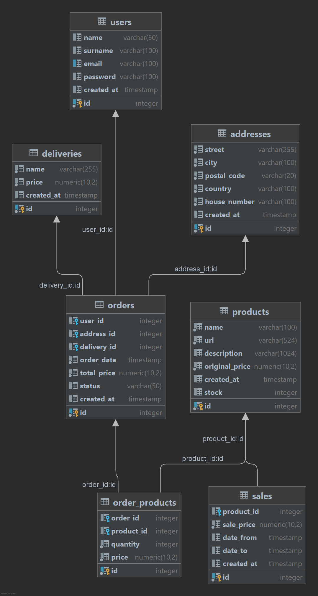

    

# Quick Harvest

Špičkový online obchod s potravinami. Ponúkame širokú škálu potravín od mliečnych výrobkov, rôznych nápojov až 
po rôzne sladké alebo slané doťuky. Patríme medzi top predajcov potravín vďaka tomu, že sme dostupní 24/7 a máme 
len tie najlepšie produkty. Zoznam hlavných kategórií produktov nájdete na konci stránky. Poďme sa teda pozrieť na 
zloženie projektu a ako dokážeme aplikáciu spustiť.

## Zloženie projektu

Projekt sa skladá z dvoch modulov a to FE a BE.  
Tieto moduly sa spúšťajú samostatne, nižšie je uvedený postup. 

## Inicializácia a spustenie oboch modulov

### FE modul
- pomocou node.js
- pridať novú konfiguráciu - vybrať npm - zmeniť "command" na start
- spustenie FE aplikácie na localhost:3000

### BE modul
- v pom.xml kliknúť pravým tlačidlom a zvoliť "build as maven project"
- spustiť databázu - návod je uvedený nižšie
- spustenie BE aplikácie na localhost:8088

### Spustenie DB
- na vytvorenie a naplnenie DB je vytvorený docker-compose.yml
- sú 2 možnosti spustenia:
  1. spustiť pomocou tlačidla v súbore docker-compose.yml v asos-be module
  2. v termináli sa prepnúť do asos-be priečinka a spustiť príkaz docker compose up --build

### DB model

### Pripojenie na DB (nie je nutné pre fungovanie aplikácie)
- v Idei je možné sa pripojiť na DB a vidieť jej obsah
- v záložke Database vybrať PostgreSQL a pripojiť sa pomocou credentials uvedených v docker-compose.yml 
alebo application.properties

## Krátky popis použitých technológií

### React.js APP
- hlavná classa- App.js (definované cesty)
- ostatné classy pridávať do package src
- inštalácia knižníc pomocou package.json
- <svg xmlns="http://www.w3.org/2000/svg" width="1.2em" height="1.2em" viewBox="0 0 512 512"><path d="M32 464h448L256 48 32 464zm248-64h-48v-48h48v48zm0-80h-48v-96h48v96z" fill="currentColor"/></svg> package-lock.json NEMENIŤ ! <svg xmlns="http://www.w3.org/2000/svg" width="1.2em" height="1.2em" viewBox="0 0 512 512"><path d="M32 464h448L256 48 32 464zm248-64h-48v-48h48v48zm0-80h-48v-96h48v96z" fill="currentColor"/></svg>
- knižnice s komponentami - MaterialUI, BOOTSTRAP
- aplikácia nepoužía klasické premmenné - využíva HOOKy
- namiesto premenných najčastejšie využíva UseState hook --> [premenná, jejSetovaciaFunkcia] = useState<>()
- atribúty sa prenášajú cez komponenty pomocou Props, vždy z rodičovského komponentu na detský

### SpringBoot APP
- hlavná classa - AsosBeApplication.java
- rest controller s endpointami v rest package
- service interface, implementácia v service package
- komunikácia s databázou v repository package
- entitné triedy v model package
- DTO triedy v dto package
- sql scripty na naplnenie databázy v resources/init-sql package
- docker-compose.yml na vytvorenie kontajnera s databázou v adresári pre BE modul
- Použitie MVC architekúry

### JWT
- na autentifikáciu používame JSON Web Token
- JWT sa skladá z 3 častí - Header, Payload a Signature
- použitie v našej aplikácii
  1. po prihlásení používateľa sa generuje JWT, do ktorého vkladáme userId
  2. JWT sa posiela v každom HTTP request Headeri aby sa nemusela opakovane pozerať DB
  3. JWT je validovaný použitím nášho SECRET kľúča
  4. JWT sú nastavené tak aby po 30 min expirovali

### VERZIE technológií
- Node.js https://nodejs.org/en verzia 18.18.2
- JAVA  Amazon Corretto 17.0.9
- Docker desktop https://www.docker.com/products/docker-desktop/

## Udržiavanie a verziovanie projektu

### GITHUB
- hlavná vetva MASTER
- vždy vytvárať nové vetvy pre tasky
- v prípade, že chceme zmeny mergnúť do main, VŽDY treba najskôr mergnúť MAster do Vetvy, pushnúť a až potom mergnúť vetvu do MASTER
- v prípade potreby vytvárať pull requesty (možnosť skontrolovať kód ostatnými, nechať komentár, automatické zobrazenie či nastáva konflikt s MASTER vetvou)
- vždy si pred prácou najskôr updatenuť MASTER
- zmysluplné  commit message
- zrozumiteľné názvy class, premenných, packageov, funkcií

#### Zoznam hlavných kategórií produktov
- Yogurt
- Milk
- Drink
- Coffee
- Pasta
- Noodles
- Rice
- Oats
- Jam
- Donuts
- Snacks
- Bubblegum
- Crisps